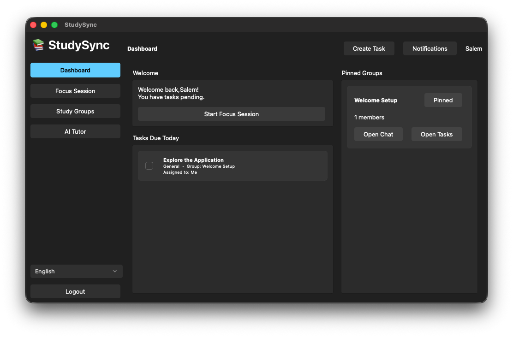

# StudySync
[Visit Our Website!](http://studysync.site/)

StudySync is a tool built to help students manage their workload and collaborate with classmates. It brings tasks, communication, and focus tools into one fast desktop application.

> Note:  
> **Project Status:** StudySync is currently **under development** and is not yet fully implemented. you may experience bugs. The AI Tutor feature is currently a placeholder and has not been implemented yet.

> **Server Requirements:** > You can now connect directly to our **official public server** for an instant setup, or continue to run the server locally if preferred.

## Features
* **Dashboard:** View all your active tasks and pinned groups in one spot.
* **Study Groups:** Create groups and invite friends to work on projects together.
* **Live Chat:** Send messages to your group members in real time.
* **Task Tracking:** Create and assign tasks to specific group members.
* **Focus Timer:** Use the built-in timer to stay productive during study sessions.
* **AI Tutor:** *(In Development)* Chat with an AI assistant to get help with difficult subjects.
* **Multilingual Support:** Study in your preferred language. Fully translated into Arabic, English, and French natively, with more languages on the way.
* **Public Server:** Skip the backend setup entirely. Connect straight to our official public server for an instant, hassle-free study environment.

## Libraries & Frameworks Used
* **Qt**
* **Boost**
* **C++**
* **SQLite**

## Project Board
Track progress and planned features here:  
https://trello.com/b/FurIPhe7/study-sync

## Credits & Acknowledgements
* **Styling:** CSS styling used is from the [Prism Launcher Fluent-Dark theme](https://github.com/PrismLauncher/Themes/blob/main/themes/Fluent-Dark/themeStyle.css).
* **Database:** Initial SQLite database schema was generated using SQLAlchemy in python and then manually integrated into the C++ application.

## Building
Run this command in your terminal to build both the client and the server:
```bash
cmake -B build && cmake --build build